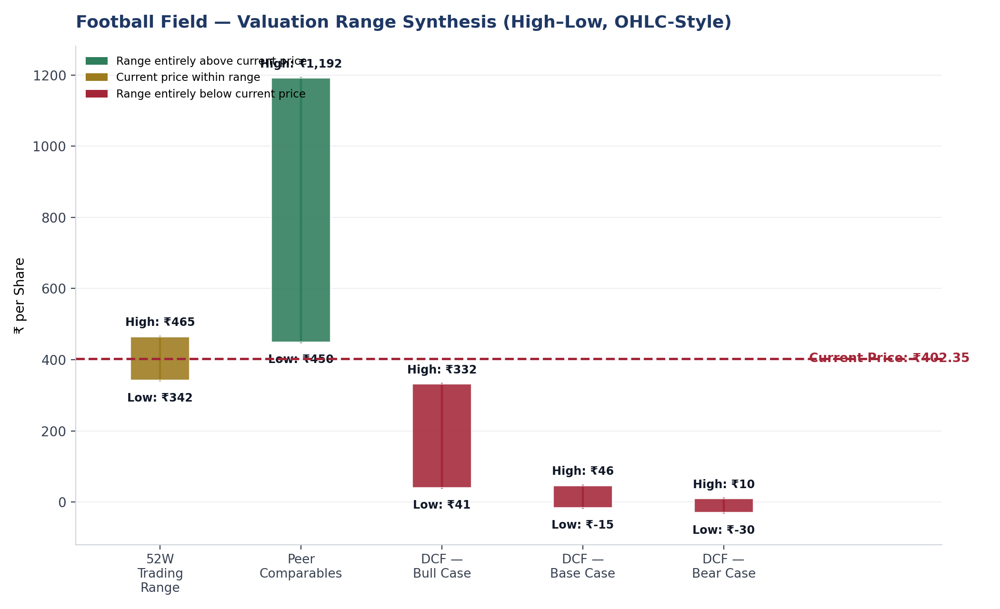
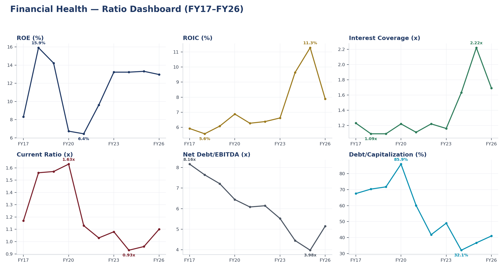
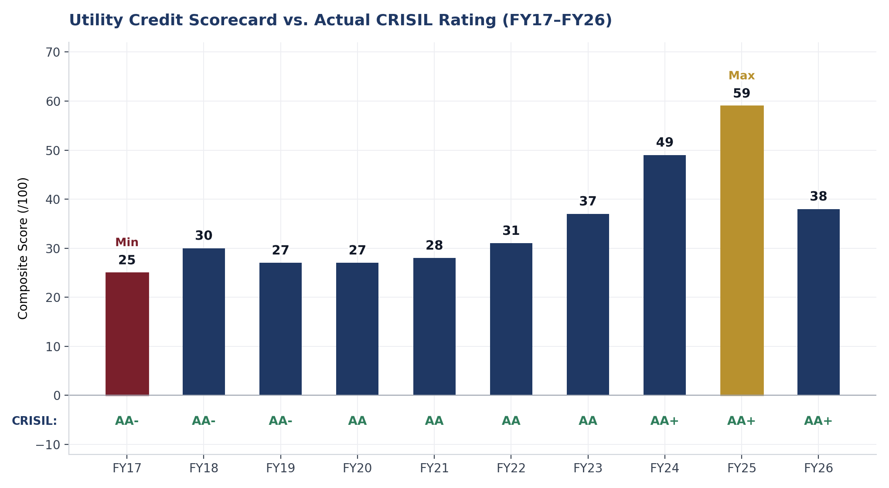
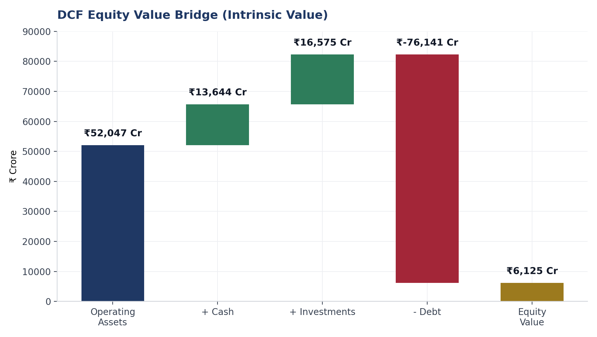
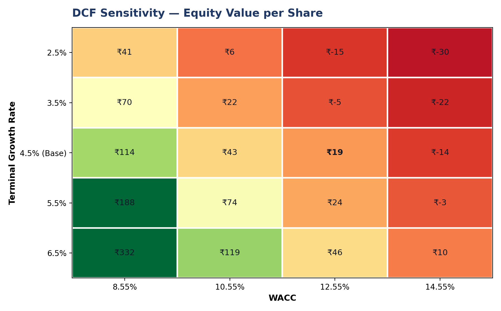
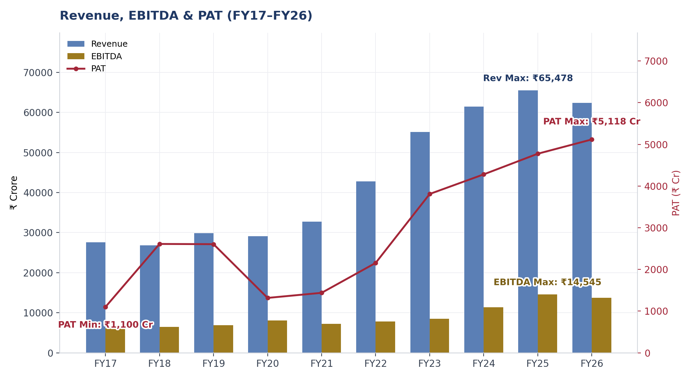

# ⚡ Tata Power Ltd. — Equity Research & Valuation

**A quantitative model that keeps disagreeing with the market — and explains, every time, exactly why.**

   

---

## The 60-Second Version

Five independent models were built on this company. **All five run more conservative than the market and the rating agencies.** That's not a coincidence, and it's not a bug — it turned into the actual finding of the project.

| Model | What it says | What reality says | The gap, explained |
|---|---|---|---|
| **DCF** | ₹19.17 / share | Market: ₹402.35 | Reinvestment cycle + unmodeled TPREL growth option |
| **Utility Credit Scorecard** | 38/100, "High Risk" | CRISIL: AA+/Stable | Purely quantitative — excludes parent support, regulatory strength |
| **Altman Z-Score** | 1.55, "Distress" | Investment-grade, 10yr clean rating history | Model built for manufacturers, not regulated utilities |
| **Regression-based multiple** | R² = 0.058 | — | Statistically insignificant; kept only to show the method, not trusted for value |
| **Peer EV/EBITDA** | 10.55x, in-line | Peers trade 10–17x | The one model that actually agrees with the market |

If you remember one thing from this project: **every gap above has a named cause, not a shrug.** That discipline — investigate the divergence instead of averaging it away — is the actual point of the repo, more than any single number in it.

---

## What's in Here

| File | What it is |
|---|---|
| `Tata Power - DCF, Relative Valuation & Risk Analysis.xlsx` | The engine — 25-sheet model, every formula traceable |
| `Financial_Analysis_Report.pdf` | 25-page deep dive — every chart, every table, every caveat |
| `Management_Presentation.pptx` | 13-slide CFO-facing deck, built to present, not just read |
| `README.md` | You are here |

> **Not investment advice.** This is a portfolio project built to demonstrate methodology — statement analysis, DCF, relative valuation, credit scoring, and risk modeling — end to end. Treat every number as a worked example, not a recommendation.

---

## Table of Contents

- [The Model, in One Picture](#the-model-in-one-picture)
- [Why a Custom Credit Scorecard Exists](#why-a-custom-credit-scorecard-exists)
- [The DCF's Honest Problem](#the-dcfs-honest-problem)
- [Methodology](#methodology)
- [Key Figures](#key-figures)
- [What I'd Do Differently Next](#what-id-do-differently-next)
- [Sources & Tools](#sources--tools)

---

## The Model, in One Picture

  

Ten years, six ratios, one story: **profitability improved sharply through FY24–25, then leverage metrics dipped in FY26** as the renewable capex cycle hit its steepest phase. Nothing here is a red flag on its own — it's a company mid-transition, and the numbers look like a company mid-transition.

---

## Why a Custom Credit Scorecard Exists

The Altman Z-Score is the textbook go-to for financial distress screening. It also happens to have been calibrated in 1968 on manufacturing firms — and it shows. Applied to a capital-intensive regulated utility, it penalizes exactly the two things that make Tata Power's balance sheet *normal for its sector*: high (but stable, regulated) leverage, and low (but structurally expected) asset turnover.

So a 9-driver **Utility Credit Quality Scorecard** was built from scratch — Net Debt/EBITDA, FFO/Net Debt, Interest Coverage, ROIC, Debt/Cap, OCF/Debt, Payout Ratio, Current Ratio, and a deliberately down-weighted Altman Z cross-reference — scored against India-utility-calibrated bands instead of global manufacturing-sector ones.

It *still* runs more conservative than the actual rating. But now the gap has a clean explanation: **the scorecard is quantitative-only, and Tata Power's AA+ is propped up by things a spreadsheet can't easily score** — Tata Group parent support, a stable regulatory relationship, a demonstrated decade of deleveraging execution. That's a genuine finding about the limits of bottom-up scoring, not a modeling error.

---

## The DCF's Honest Problem

₹19.17 a share, against a market price of ₹402.35. Before assuming something's broken, the sensitivity grid below tests every combination of WACC (8.55%–14.55%) and terminal growth (2.5%–6.5%) the model could reasonably support:

Even the single most generous cell on this entire grid — ₹332 — still lands under market price. That rules out "unlucky assumptions" as the explanation. What's left: the reinvestment rate (84%→56% of NOPAT across the forecast) genuinely suppresses near-term cash flow during an active capex cycle, and — the bigger piece — this is a **consolidated single-entity model that can't see the standalone growth-option value of TPREL**, Tata Power's renewable arm, which isn't separately listed. A sum-of-the-parts valuation is the logical next step and is flagged as exactly that: a next step, not a footnote to bury.

---

## Methodology

Built with Aswath Damodaran's valuation frameworks as a reference point — CAPM, bottom-up beta, FCFF discounting, stable-growth constraints — **adapted to the data actually available**, not claimed as a full replication. Where the textbook approach needed data this project didn't have, that's said outright rather than quietly patched over.

**Full stack:** 10-year statement analysis → ratio & DuPont decomposition → Beta regression (2yr weekly, R²=0.36, p<0.001) → CAPM cost of equity → WACC → 3-stage FCFF DCF with a full sensitivity grid → peer relative valuation (+ a regression that's included *specifically because* it fails, to show that failure gets caught, not hidden) → 9-driver credit scorecard → 3-method VaR (historical, parametric, Monte Carlo) → football field synthesis.

---

## Key Figures

| Metric | Value |
|---|---|
| WACC | 11.78% |
| Cost of Equity (CAPM) | 15.52% |
| Beta (2yr weekly regression) | 1.26 |
| DCF Equity Value / Share | ₹19.17 |
| Market Price / Share | ₹402.35 |
| Utility Credit Scorecard (FY26) | 38/100 — "High Risk" |
| Actual Credit Rating (FY26) | CRISIL AA+ / ICRA AA+ (Stable) |
| Peer EV/EBITDA | 10.55x |

---

## What I'd Do Differently Next

Because a portfolio project should own its gaps as openly as it owns its findings:

- **Sum-of-the-parts valuation** for TPREL — the single highest-leverage fix for the DCF gap
- **Qualitative overlay** on the credit scorecard — even a simple 3-factor add-on (regulatory strength, parent support, execution track record) would likely close most of the scorecard-vs-rating gap
- **Segment-level revenue and capacity mix** — not available in the underlying data model this time; would sharpen the Company Overview materially
- **Scenario-based NOPAT paths** — the current DCF assumes smooth growth; a transition business like this one plausibly sees a step-change once renewable capacity is fully commissioned, and the model doesn't yet have a mechanism for that

---

## Sources & Tools

Historical financials via Screener.in · Tata Power investor presentations (FY25–FY26) · CRISIL rating rationales (2019–2025) · Valuation approach informed by Aswath Damodaran (NYU Stern) · Built in Excel, Python (matplotlib), and a lot of double-checking.

*Built and maintained as a personal portfolio project. Feedback — especially disagreement — welcome via issues or PRs.*

